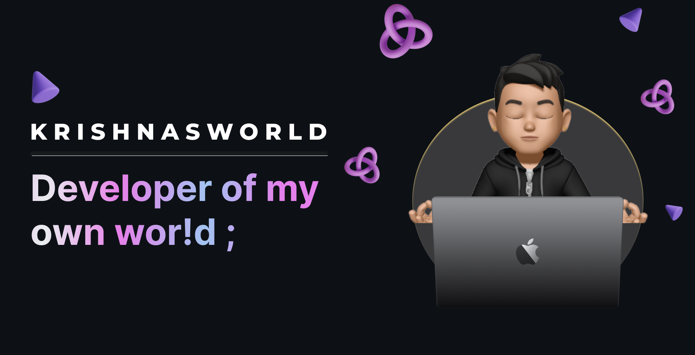

  

  

  
  &nbsp;
  
  &nbsp;
  
  &nbsp;
  

  

---

## 🚀 **About Me**

 **Building the future, one line of code at a time** 

<table>
<tr>
<td width="50%" valign="top">

### 🎯 **Current Focus**
- 🎓 **Student** at Canara Engineering College
- 🚀 **Building:** [AETHERIAL](http://aetherial.netlify.app) - Smart Helmet for Road Safety
- 🌱 **Mastering:** Java, Advanced React Patterns, System Design
- 💼 **Seeking:** Internships & Open Source Collaborations

</td>
<td width="50%" valign="top">

### 🏆 **Highlights**
- 🥉 **3rd Place** in Infothon Hackathon at VVCE
- 💼 **Frontend Dev** at Youga
- 🍰 **Full Stack Dev** at My FreshBake
- 🌍 **Location:** India
- ⚡ **Superpower:** Coding without coffee! ☕➡️❌

</td>
</tr>
</table>

---

## 🛠️ **Tech Arsenal**

&nbsp;***Languages & Tools I work with...***

### **Frontend Magic** ✨

### **Backend Power** ⚡

### **AI/ML & DevOps** 🤖

---

## 🌟 **Featured Projects**

*Building solutions that matter* 🚀

<table>
<tr>
<td width="50%" align="center">

### 🎪 [**Aakriti 2025**](https://aakriti.canaraengineering.in)
**College Fest Registration Platform**

💰 **₹5.7 Lakhs** processed | 🎯 **100% uptime**

</td>
<td width="50%" align="center">

### 🛡️ [**Aetherial**](https://aetherial.netlify.app/)
**Smart Helmet for Road Safety**

🏆 **3rd Place** winner at VVCE Infothon

</td>
</tr>
<tr>
<td width="50%" align="center">

### 🧠 [**MindCare**](https://mindcare-cec.vercel.app/)
**AI-Based Depression Detection**

🧠 Mental health analysis using sentiment AI

</td>
<td width="50%" align="center">

### 📚 [**EDU-CEC**](https://edu-cec.vercel.app)
**AI-Powered LMS for College**

🤝 Peer-learning with AI-based proctoring

</td>
</tr>
</table>

---

## 📊 **GitHub Analytics**

&nbsp;***Data-driven development...***

<table>
<tr>
<td width="50%">

</td>
<td width="50%">

</td>
</tr>
</table>

---

## 🏅 **Achievement Gallery**

&nbsp;***Collecting digital badges...***

---

## 🤝 **Let's Connect & Build Together**

&nbsp;***Reach out for collaborations...***

<table>
<tr>
<td align="center">

</td>
<td align="center">

</td>
<td align="center">

</td>
<td align="center">

</td>
</tr>
</table>

---

### 💭 **"Code is like humor. When you have to explain it, it's bad."** – Cory House

